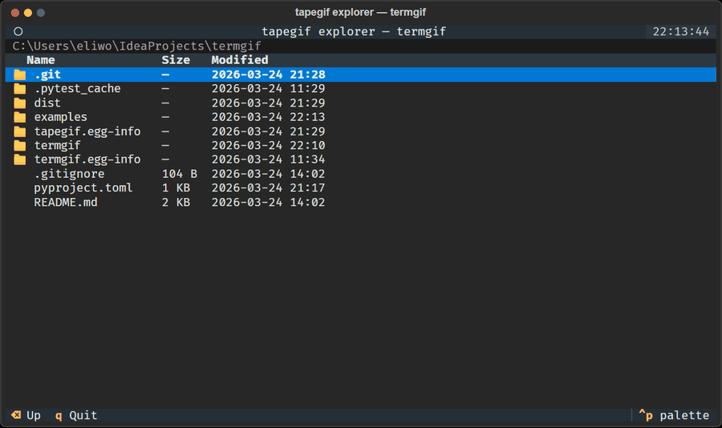

# tapegif

Record animated GIFs of [Textual](https://github.com/Textualize/textual) terminal apps.



```
pip install tapegif
tapegif record myapp.py --tape demo.tape --output demo.gif
```

No screen capture. No window focus tricks. Drives your app headlessly via Textual's Pilot API, renders each SVG frame through a real browser (Playwright), assembles with Pillow. Works in CI. Same GIF every run. Works on Windows, macOS, Linux.

## install

```
pip install tapegif
playwright install chromium
```

## quick start

**1. Scaffold a tape file:**

```
tapegif init
```

This writes a `demo.tape` in the current directory. Edit it to match your app.

**2. Record:**

```
tapegif record path/to/yourapp.py --tape demo.tape
```

Outputs `demo.gif` by default.

## tape format

```yaml
size: [120, 30]       # terminal cols × rows
gif_width: 900        # output GIF width in pixels
app_args: {}          # kwargs passed to your App constructor

steps:
  - sleep: 3.0        # wait for app to load
    capture: 2000     # snapshot and hold this frame 2s in the GIF

  - press: a          # press a key
    sleep: 0.4
    capture: 1200

  - type: "hello"     # type a string
    sleep: 0.5
    capture: 1000

  - press: enter
    sleep: 0.2
    capture: 800
```

Each step can have:
- `press` — a single key name (`a`, `space`, `enter`, `ctrl+c`, etc.)
- `type` — a string to type character by character
- `sleep` — seconds to wait after the action
- `capture` — take a snapshot and hold it this many ms in the output GIF

Steps without `capture` perform their action without recording a frame.

## passing constructor args

```yaml
app_args:
  root: /home/user/projects
  older_than: 30
  min_size_mb: 10
```

## CLI reference

```
tapegif record APP [--tape FILE] [--output FILE] [--width PX]
tapegif init [--output FILE]
```

`APP` is `path/to/file.py` (auto-discovers the App class) or `path/to/file.py:ClassName` (explicit).

## requirements

- Python 3.10+
- Textual 0.80+
- Playwright (Chromium)
- Pillow

## license

MIT
